<div align="center">


<br>

```
┌─────────────────────────────────────────────────────────┐
│  💡 Innovating at the Intersection of AI & Hardware    │
│  🎓 B.E. CSE @ RVCE | 📍 French Rocks, Karnataka       │
└─────────────────────────────────────────────────────────┘
```

[](https://github.com/[username])
[](https://linkedin.com/in/[profile])
[](mailto:[email])
[]()

</div>

---

## 🚀 About Me

```javascript
const engineer = {
    name: "ANWESHA",
    role: "AI/ML Engineer & Systems Researcher",
    education: "B.E. CSE @ RVCE (2024-2028)",
    location: "French Rocks, Karnataka 🇮🇳",
    achievements: {
        jee_percentile: "98.6%ile 🎯",
        research: "IEEE Transactions (Under Review) 📄",
        impact: "1000+ Students Empowered 🎓",
        performance_boost: "25% IPC Improvement ⚡"
    },
    currently_working_on: [
        "🔬 Reconfigurable CPU Optimization (ADAPT Algorithm)",
        "🤖 AI-Powered EdTech Platform (DigiGyaan)",
        "🛰️ Satellite Technology (RVSAT BioSat Launch)",
        "💡 Accessible AI Solutions for All"
    ],
    life_philosophy: "Innovate. Impact. Inspire. 🌟"
};
```

---

<div align="center">

## 🔬 Research & Innovation

</div>

<table>
<tr>
<td width="60%">

### 📊 **ADAPT: Revolutionizing Reconfigurable CPUs**
**IEEE Transactions on Computers** *(Under Review)* 

**🎯 Breakthrough Results:**
- ⚡ **25% IPC Performance Gain**
- 📈 **20.8% Resource Utilization Boost**
- 🧠 Real-time Online Profiling
- 🔧 Smart Defragmentation Algorithm

**Stack:** `Python Simulator` `SPEC CPU Benchmarks` `Performance Analytics`

</td>
<td width="40%">

```
    📊 Performance Impact
    
    ╔════════════════════╗
    ║  Before → After   ║
    ╠════════════════════╣
    ║  IPC: +25% ⚡     ║
    ║  Util: +20.8% 📈  ║
    ║  Efficiency: 🚀   ║
    ╚════════════════════╝
```

</td>
</tr>
</table>

---

### 🩺 **AI-Powered Medical Diagnostics**
**Pneumonia Detection System** | 92% Accuracy | Explainable AI

> Trained on **5,000+ chest X-rays** using **DenseNet121** & **EfficientNetB0** with Grad-CAM visualization for transparent medical AI 🏥✨

---

<div align="center">

## 💼 Featured Projects

</div>

### 🎓 **DigiGyaan EdTech Platform**
*Empowering 1000+ Students Nationwide* | Lead Developer

```mermaid
graph TB
    A[👨‍💻 Next.js Frontend] --> B[🔥 Flask Backend]
    B --> C[🗄️ PostgreSQL]
    B --> D[🤖 FLAN-T5 AI]
    D --> E[☁️ AWS Cloud]
    E --> F[⚡ 120KB Load Time]
    style A fill:#61dafb
    style B fill:#000
    style D fill:#ff6b6b
    style E fill:#ff9500
```

<div align="center">



</div>

**Tech:** `Next.js` `Flask` `PostgreSQL` `FLAN-T5` `AWS` | **Impact:** 📱 Mobile-First | 🚀 Lightning Fast

---

<table>
<tr>
<td width="50%" valign="top">

### 🌐 **IoT Smart Inventory**
**ESP32 | MQTT | Real-time Dashboard**

- ⚙️ Smart Sensor Network
- 📊 Live Monitoring Dashboard  
- ⏱️ **45% Time Reduction**
- 🔔 Automated Alerts

</td>
<td width="50%" valign="top">

### 🎤 **Audio-Image Captioning**
**Accessibility AI | 5K+ Images**

- ♿ Hearing-Impaired Support
- 🖼️ ResNet50 Vision Model
- 🔊 Google Cloud TTS
- 🌐 Streamlit Deployed

</td>
</tr>
<tr>
<td width="50%" valign="top">

### ⚖️ **Legal Rights AI Assistant**
**NLP Chatbot | 500+ Documents**

- 🤖 Transformer-based Retrieval
- 📚 Comprehensive Legal DB
- ✅ **85% Query Resolution**
- 💬 Natural Language Interface

</td>
<td width="50%" valign="top">

### 🛰️ **RVSAT BioSat Mission**
**Space Tech | Dec 2024 Launch**

- 🚀 Satellite Development
- 🔬 Biological Experiments
- 👥 Cross-team Collaboration
- 🌌 Space Innovation

</td>
</tr>
</table>

---

<div align="center">

## 🏆 **Hall of Fame**

</div>

<table>
<tr>
<td align="center" width="33%">

🥉 **3rd Place**  
RVCE Hult Prize 2026  
*E-Cell@RVCE*

</td>
<td align="center" width="33%">

🏆 **Multiple Hackathon Wins**  
Data Science + Robotics  
*National Level*

</td>
<td align="center" width="33%">

🏅 **AIR 506**  
Critical Thinking Olympiad  
*SOF 2016*

</td>
</tr>
</table>

---

<div align="center">

## 🎓 **Academic Excellence**

</div>

| 🎯 Achievement | 📊 Score | 🗓️ Year |
|:--------------|:---------|:--------|
| **JEE Mains** | 98.6 %ile | 2024 |
| **12th Grade** | 97.5% | 2024 |
| **10th Grade** | 96.8% | 2022 |

**B.E. Computer Science & Engineering** | RVCE | 2024–2028

---

<div align="center">

## 👥 **Leadership & Impact**

</div>

```
🎤 WiC Team Lead               → 200+ Workshop Attendees
🤝 Rotaract Team Lead          → 500+ Community Impact
🛰️ Antariksh | Accelerate     → Aerospace Innovation
🎨 SATTVA Art Club             → Creative Expression
💃 FOOTPRINTS Dance Club       → Multiple Prizes
```

---

<div align="center">

## 🛠️ **Tech Arsenal**

</div>

### **Languages**


### **Frameworks & Tools**


### **Specializations**
`AI/ML` `Computer Architecture` `Operating Systems` `Embedded Systems/IoT` `System Design` `Research & IEEE Publications`

---

<div align="center">

## 📊 **GitHub Analytics**


</div>

---

<div align="center">

## 🌈 **Let's Build the Future Together!**

*"Innovation distinguishes between a leader and a follower." - Steve Jobs*

### 📬 **Get In Touch**

[](https://github.com/[username])
[](https://linkedin.com/in/[profile])
[](mailto:[email])

---


**💙 Thanks for stopping by! Let's innovate together! 💙**


</div>
